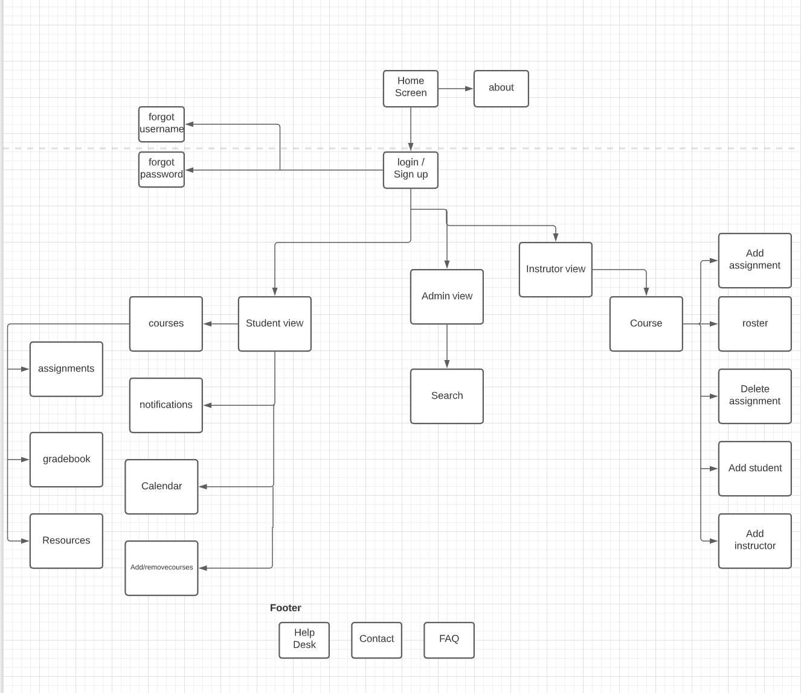
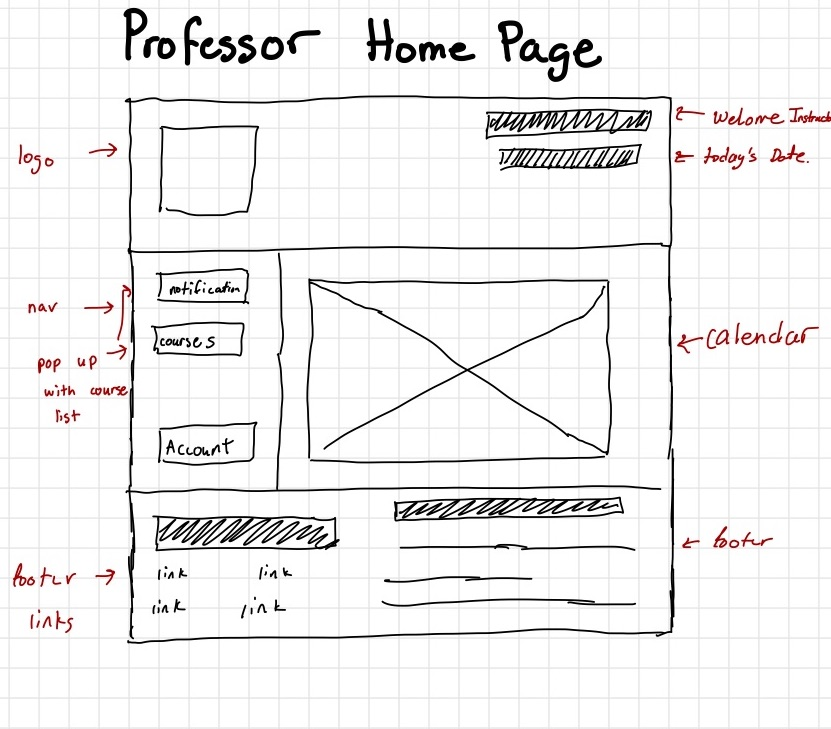

# ChalkBoard
<<<<<<< HEAD
## Contributions~ Mario Mamtsaderis

When working on this deliverable, I learned how important wireframes and sitemaps are when designing a website. Creating a sitemap before designing a website provides many different benefits. Think of a sitemap as like a blueprint for your website. A sitemap allows you to prioritize what content and pages are most important. By visually presenting all of your site content to the user, it’s easier to talk about how user flow matches with website goals. Wireframes show the construction of individual pages of your website. Wireframes give your team or developing partner a preview of the content blocks, features, and functionality of each page. They start to hint at overall page layout but don’t include design elements. Used together, wireframes and sitemaps give developers a slight advantage when it comes time to build the website as it gives a preview of how the website will look visually as well as how the website is going to function.
=======

Please visit our website here:
https://jagman-dot.github.io/ChalkBoard/

# Team Memebers
* Jagmandeep Dhaliwal
* Mario Mamtsaderis

## Site Map

Here is how we invision the layout of chalkboard. SiteMap was created using an online resouce, LucidCharts.

## WireFrames

All of the below wireframes were hand drawn using an Ipad.

## Contributions~Mario Mamtsaderis

When working on this deliverable, I learned how important wireframes and sitemaps are when designing a website. Creating a sitemap before designing a website provides many different benefits. Think of a sitemap as like a blueprint for your website. A sitemap allows you to prioritize what content and pages are most important. By visually presenting all of your site content to the user, it’s easier to talk about how user flow matches with website goals. Wireframes show the construction of individual pages of your website. Wireframes give your team or developing partner a preview of the content blocks, features, and functionality of each page. They start to hint at overall page layout but don’t include design elements. Used together, wireframes and sitemaps give developers a slight advantage when it comes time to build the website as it gives a preview of how the website will look visually as well as how the website is going to function.

## Contributions~ Jagmandeep Dhaliwal

I learned a lot from this one assignment, I learned how from the perspective of a end user, how to design a website that stays in algin with the requirements but also provides ease of use. While planning the site map and wireframes, my partner, and I got exposure of how early stages of web projects are carried out and thought of. WireFrames play a huge role of having a successful product in the future, as it provides initial layouts for the website, and can save you time before you go and start coding randomly. I also got work on github with a partner how coding is done in the real world.
>>>>>>> 486e89d931e73ecc34a9af335f0dc5ecac2747ea
